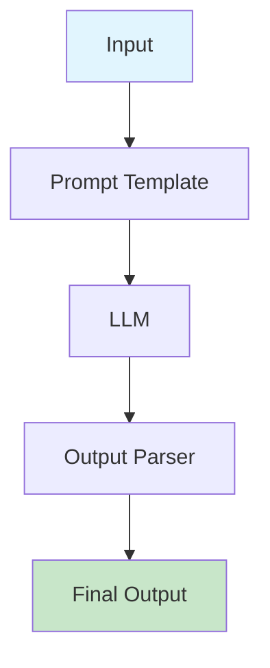
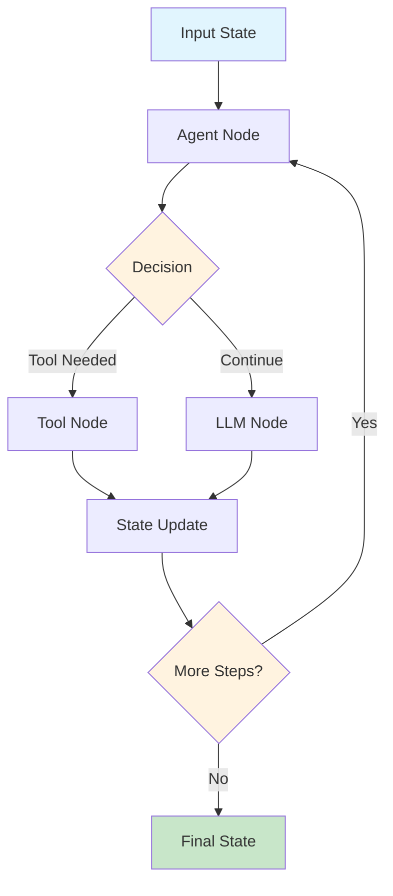

[Video: LangChain vs LangGraph: A Tale of Two Frameworks](https://www.youtube.com/watch?v=qAF1NjEVHhY)

- LangChain   = What happens *inside* each node  (LLM prompt → output → tool call)
- LangGraph   = How nodes pass messages & state  (graph scheduler + checkpoints)

Both coexist: every LangGraph node is still a LangChain Runnable, so moving from linear chains to a stateful graph is mostly about adding the orchestration layer, not rewriting the business logic.

## Typical Workflows

### LangChain Workflow

### LangGraph Workflow

